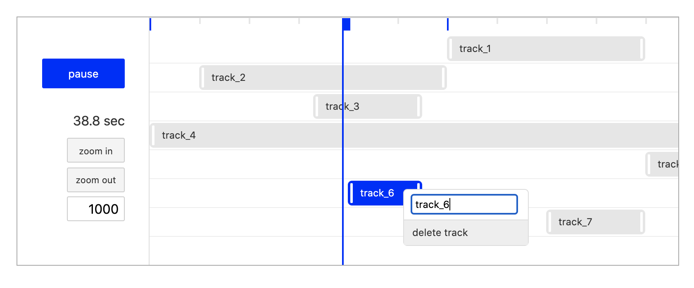

# Sveltmline
A timeline component for svelte.

Typescript is available. Follow the instruction [here](https://svelte.dev/blog/svelte-and-typescript).



## Usage
Import sveltmline by npm.
```
npm i sveltmline
```

```Svelte
<script lang="ts">
import { genTracks, TimelineFrame, TrackAsset, ITrackable } from 'sveltmline'

class Obj implements ITrackable {
	visible = false;
    url = undefined; // by assigning url, a track automatically be a video track
    OnLoadHtmlElement(elm: HTMLElement){}; // called once when element is loaded
    tick(depth: number){}; // called every frame
}

const tracks:any = genTracks<Obj>();
const t1 = new TrackAsset(new Obj(), 'track_1'); t1.setposition(60, 100);  tracks.push(t1);
const t2 = new TrackAsset(new Obj(), 'track_2'); t2.setposition(10, 60);   tracks.push(t2);
const t3 = new TrackAsset(new Obj(), 'track_3'); t3.setposition(33, 55);   tracks.push(t3);
const t4 = new TrackAsset(new Obj(), 'track_4'); t4.setposition(0, 150);   tracks.push(t4);
const t5 = new TrackAsset(new Obj(), 'track_5'); t5.setposition(100, 140); tracks.push(t5);
const t6 = new TrackAsset(new Obj(), 'track_6'); t6.setposition(40, 55);   tracks.push(t6);
const t7 = new TrackAsset(new Obj(), 'track_7'); t7.setposition(80, 100);  tracks.push(t7);
</script>

<div id="outer">
<TimelineFrame px_h={300} px_w={800} tracks={tracks}/>
</div>
```

you can optionally set styles for timeline
```Svelte
<script lang="ts">
...
const styles = new Style();
styles.vertical = true;
styles.bcgd_col = '#ffffff';
styles.base_col = '#e6e6e6';
styles.slct_col = '#0022ff';
styles.curr_col = '#0022ff';
styles.base_txt = '#333333';
styles.slct_txt = '#ffffff';
...
</script>

<div id="outer">
<TimelineFrame px_h={300} px_w={800} tracks={tracks} styles={styles}/>
</div>
```

## License
[MIT](LICENSE)